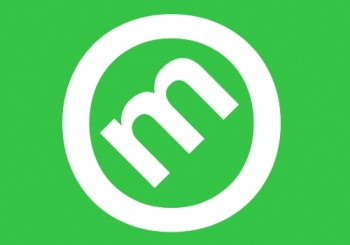

  

 

<h1 align="center">Nintendo Review Data Scraper</h1>

A repository to hold Jupyter Notebook code for a game information web scraper.

Best selling game information is scraped from [Wikipedia](https://en.wikipedia.org/wiki/List_of_best-selling_Nintendo_Switch_video_games) and merged with data scraped from [Metacritic](https://www.metacritic.com/).

 

## **Repository Contents**

- [**Scraper Code**](https://github.com/neoreuvenla/review-web-scraper/blob/main/scraper.ipynb)
- [**Output Data**](https://github.com/neoreuvenla/review-web-scraper/blob/main/data/scrapedata.csv)